# FlowImageMaster 사용 설명서

Google Flow에서 유튜브 영상용 장면 이미지를 **대량으로 생성하고, 장면마다 한 장을 고르고, 고른 이미지를 자동으로 업스케일**하는 데스크톱 앱입니다. 대본 작업으로 만든 `*_flow_prompts.txt` 파일 하나를 드롭하면 나머지는 앱이 진행합니다.

이 저장소는 배포용입니다. 최신 버전: **[Releases](https://github.com/ohmyzhs/flow-image-master-releases/releases/latest)**

> 아래 화면은 앱의 데모 데이터로 찍은 것이라 이미지 자리에 색 상자가 보입니다. 실제 사용 시에는 생성된 그림이 들어갑니다.

---

## 목차

1. [설치](#1-설치)
2. [화면 구성](#2-화면-구성)
3. [Flow 로그인과 계정](#3-flow-로그인과-계정)
4. [브라우저 보기 / 숨기기](#4-브라우저-보기--숨기기)
5. [프로젝트 등록 — flow_prompts 파일](#5-프로젝트-등록--flow_prompts-파일)
6. [이미지 생성](#6-이미지-생성)
7. [이미지 선택 — 고르면 자동 업스케일](#7-이미지-선택--고르면-자동-업스케일)
8. [완료 처리](#8-완료-처리)
9. [문제가 생겼을 때 — Flow 연결과 복구](#9-문제가-생겼을-때--flow-연결과-복구)
10. [장면 하나만 다시 만들기](#10-장면-하나만-다시-만들기)
11. [Flow 동기화 · 씬 매핑](#11-flow-동기화--씬-매핑)
12. [이미지만 따로 업스케일](#12-이미지만-따로-업스케일)
13. [Flow 워터마크 제거](#13-flow-워터마크-제거)
14. [설정](#14-설정)
15. [로그](#15-로그)
16. [자주 묻는 것](#16-자주-묻는-것)
17. [변경 이력](#17-변경-이력)

---

## 1. 설치

### Windows

[Releases](https://github.com/ohmyzhs/flow-image-master-releases/releases/latest)에서 둘 중 하나를 받습니다.

| 파일 | 설명 |
|---|---|
| `FlowImageMaster-windows-x64-portable.exe` | 설치 없이 실행되는 단일 파일. 원하는 폴더에 두고 더블클릭 |
| `FlowImageMaster_<버전>_x64-setup.exe` | 설치 프로그램. 시작 메뉴·제거 항목이 생기고, WebView2 런타임이 없는 PC에서는 자동으로 받아 설치 |

처음 실행하면 **"Windows의 PC 보호"** 파란 창이 뜹니다. 코드 서명이 없어서 나오는 SmartScreen 경고이며 한 번만 뜹니다. **추가 정보 → 실행**을 누르면 됩니다. 설치 프로그램도 같습니다.

필요한 것:

- **Google Chrome 또는 Microsoft Edge.** Chrome을 먼저 찾고, 없으면 Edge를 씁니다. Edge는 Windows에 기본 포함이라 따로 설치할 것이 없습니다. 앱은 여러분이 평소 쓰는 브라우저 프로필을 건드리지 않고 **전용 프로필**을 따로 만듭니다.
- **WebView2 런타임.** Windows 10/11에는 이미 있습니다. 포터블 exe가 창을 못 띄우면 설치 프로그램을 쓰세요.
- **Vulkan을 지원하는 GPU 드라이버.** 업스케일에만 필요합니다. 없으면 생성과 선택은 되고 업스케일만 실패합니다.

### macOS

`FlowImageMaster_<버전>_aarch64.dmg` (Apple Silicon). 서명이 없어 최초 실행 시 **시스템 설정 → 개인정보 보호 및 보안 → "확인 없이 열기"**를 한 번 눌러야 합니다. Google Chrome이 설치되어 있어야 합니다.

### 실행 중 화면 잠금

앱이 켜져 있는 동안은 **화면 꺼짐·잠금·절전이 자동으로 억제**됩니다. 노트북에서 한 시간짜리 생성을 돌려도 중간에 잠기지 않습니다. 앱을 닫으면 원래대로 돌아갑니다.

---

## 2. 화면 구성

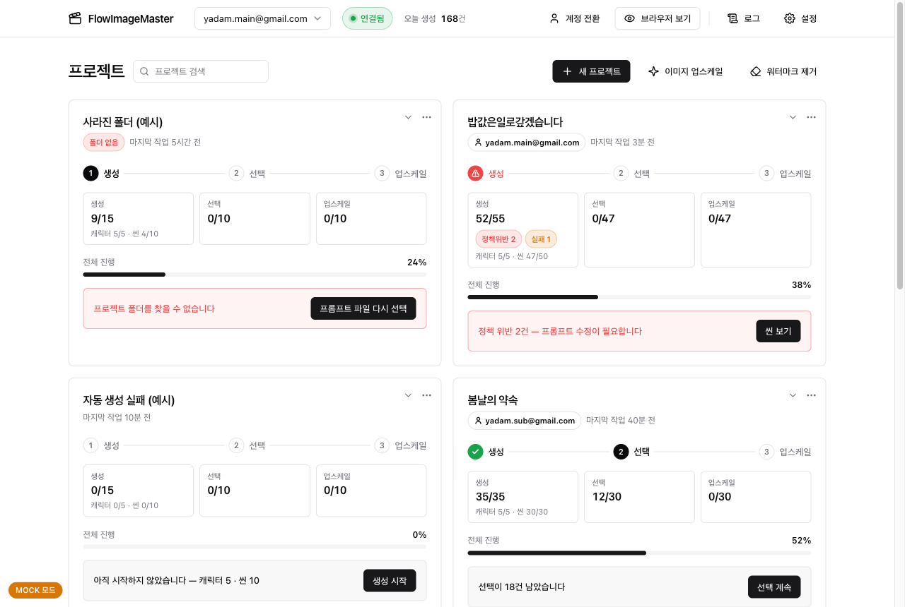

- **상단 바**: 계정, Flow 연결 상태, 오늘 생성 건수, [계정 전환], [브라우저 보기], **[로그]**, **[설정]**
- **프로젝트 목록**: 프로젝트마다 `생성 → 선택 → 업스케일` 3단계 진행 상황과 다음에 할 일 버튼. 카드의 이메일 배지는 그 프로젝트가 묶인 계정입니다(3장)
- **[새 프로젝트]** `flow_prompts` 파일 선택 · **[이미지 업스케일]** 단독 업스케일 도구(12장) · **[워터마크 제거]** 단독 워터마크 제거 도구(13장)

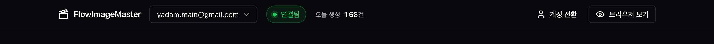

상단 바의 항목:

| 항목 | 의미 |
|---|---|
| 이메일 드롭다운 | 지금 쓰는 Google 계정. 계정을 여러 개 등록했으면 여기서 바꿉니다 |
| 🟢 연결됨 | 자동화 브라우저가 Flow에 로그인된 상태. `로그인 필요`면 3장을 보세요 |
| 오늘 생성 N건 | 이 앱이 오늘 Flow에 보낸 생성 요청 수. 자정에 0부터 다시 셉니다 (앱 밖에서 직접 만든 것은 포함 안 됨) |
| [계정 전환] | 다른 Google 계정으로 로그인 |
| [브라우저 보기] | 뒤에서 돌고 있는 자동화 브라우저를 화면에 꺼냅니다 (4장) |
| [로그] | 작업 기록 (15장) |
| [설정] | 생성 옵션과 계정별 옵션 (14장) |

---

## 3. Flow 로그인과 계정

앱은 **자기만의 Chrome 창**을 화면 밖에 띄워 Flow를 조작합니다. 그 창에 Google 로그인이 되어 있어야 합니다. 로그인은 **처음 한 번**만 하면 되고, 이후에는 앱을 껐다 켜도 유지됩니다.

1. 상단 바의 **[Google 로그인]** (이미 연결돼 있으면 [계정 전환])을 누릅니다.
2. Chrome 창이 앞으로 나옵니다. 거기서 평소처럼 Google에 로그인합니다.
3. 로그인이 끝나면 **그 Chrome 창을 닫습니다.** 앱이 창이 닫힌 것을 감지해 로그인 상태를 확인하고 `연결됨`으로 바뀝니다.

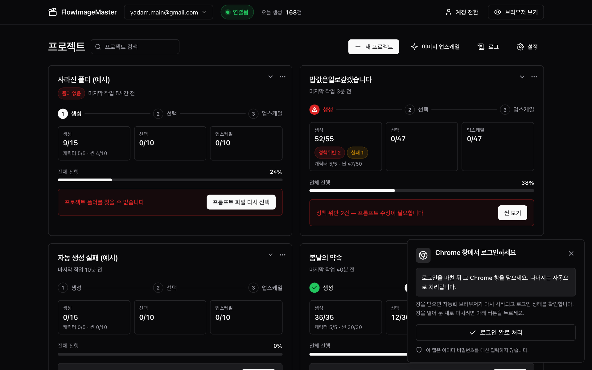

- 창을 닫지 않고 끝내려면 안내 패널의 **[로그인 완료 처리]**를 누릅니다.
- 앱은 아이디·비밀번호를 대신 입력하지 않습니다. 로그인은 항상 여러분이 Chrome 창에서 직접 합니다.
- 상단 바의 이메일은 로그인된 계정을 Chrome 프로필에서 읽어 표시합니다.

**프로젝트는 계정에 묶입니다.** 처음 생성을 시작한 계정이 그 프로젝트의 계정이 되고, 카드와 프로젝트 화면에 이메일 배지로 보입니다. 이후 생성·재생성·인트로·썸네일·동기화는 활성 계정이 무엇이든 **그 계정으로** 돕니다. 다른 계정이 활성이고 프로젝트 계정에 로그인 기록이 없으면 "이 프로젝트는 계정 N(…)에 연동되어 있습니다 — 그 계정으로 로그인해 주세요"라고 거부합니다. Flow 프로젝트 ID는 계정 안에만 있어서, 다른 계정으로 돌리면 엉뚱한 새 Flow 프로젝트가 생기기 때문입니다.

**로그인 필요**로 바뀌었다면 Flow 세션이 만료된 것입니다. 생성 중이었다면 큐가 멈추고 알림이 옵니다. 다시 [Google 로그인] → 로그인 → 창 닫기 → [이어서 생성].

---

## 4. 브라우저 보기 / 숨기기

자동화 Chrome은 평소 화면 밖에 숨어 있어 작업에 방해가 되지 않습니다. 무슨 일이 벌어지는지 직접 보고 싶거나, Flow에서 손으로 뭔가 해야 할 때 **[브라우저 보기]**를 누르면 창이 화면 가운데로 나옵니다. 같은 자리의 **[브라우저 숨기기]**로 다시 치웁니다.

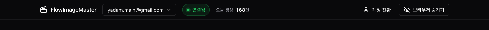

주의:

- 보기 상태에서 **그 Chrome 창이나 탭을 닫아도** 앱은 다음 작업 때 새 창을 다시 엽니다. 생성 중이던 장면은 한 번 재시도됩니다.
- Chrome 창에서 Flow를 직접 조작하는 것은 생성이 멈춰 있을 때만 하세요. 생성 중에 화면을 바꾸면 그 장면이 실패로 처리될 수 있습니다.

---

## 5. 프로젝트 등록 — flow_prompts 파일

대본 작업에서 만든 `이름_flow_prompts.txt` 파일을 **앱 창 아무 데나 드롭**하거나 **[새 프로젝트]**로 선택합니다.

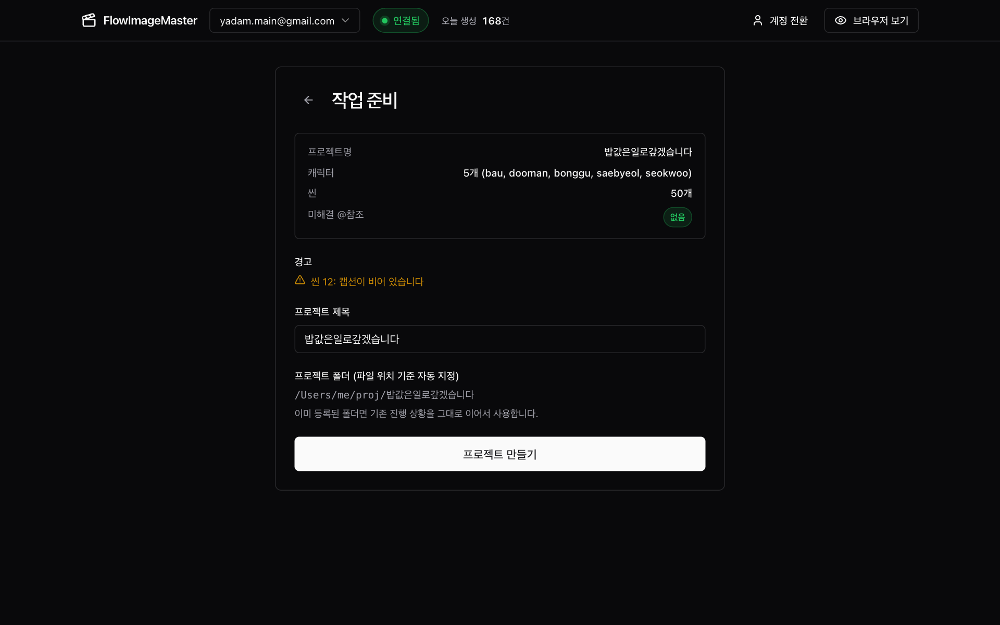

- 파일을 읽어 **캐릭터 수, 씬 수, 미해결 `@참조`**를 보여 줍니다. 씬 프롬프트가 정의되지 않은 캐릭터를 `@이름`으로 부르면 `미해결`로 잡히고, 이 상태로는 시작할 수 없습니다. 파일을 고쳐 다시 드롭하세요.
- **경고**는 진행은 되지만 확인이 필요한 항목입니다 (예: 캡션이 빈 씬).
- **프로젝트 폴더**는 파일이 있는 폴더로 자동 지정됩니다. 생성된 이미지는 그 안의 `Scene_Images/`에 저장됩니다.
- 같은 폴더를 다시 드롭하면 새로 만들지 않고 **기존 진행 상황을 이어서** 씁니다.

**[프로젝트 만들기]**를 누르면 목록에 카드가 생깁니다. 자동으로 시작되지는 않습니다.

---

## 6. 이미지 생성

프로젝트 카드를 눌러 들어가서 **[생성 시작]**을 누릅니다.

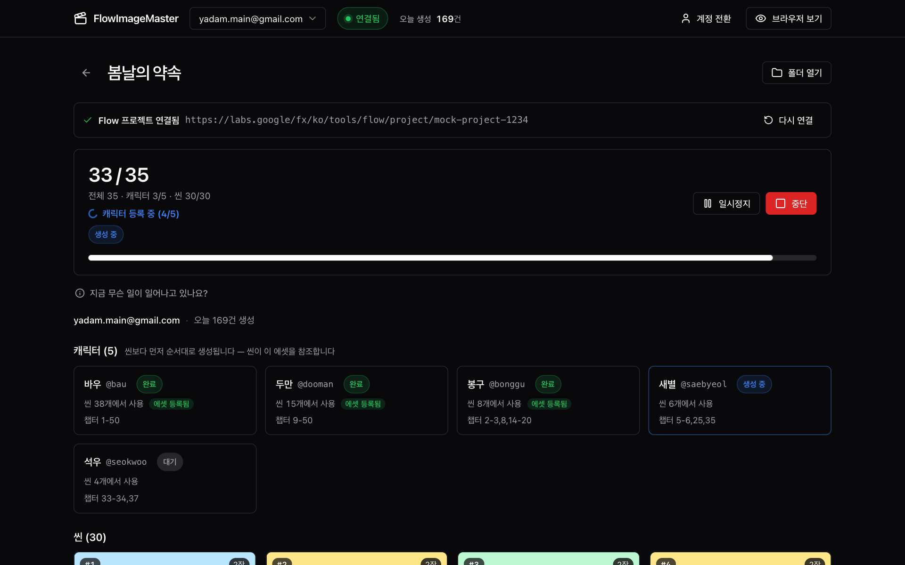

진행 순서:

1. **Flow 프로젝트 생성.** 앱이 Flow에 새 프로젝트를 만들고, 이름을 앱 프로젝트명과 같게 맞춥니다. 화면 위 `Flow 프로젝트 연결됨` 줄에 주소가 표시됩니다.
2. **캐릭터 등록.** 파일에 정의된 캐릭터를 하나씩 순서대로 Flow에 등록합니다. 씬이 이 캐릭터를 `@이름`으로 참조하므로 반드시 먼저 끝나야 합니다.
3. **검토 대기.** 캐릭터가 전부 등록되면 큐가 스스로 멈추고 알림(Dock 튀기기 / 작업 표시줄 깜빡임)을 보냅니다. [브라우저 보기]로 캐릭터 그림을 확인하고 마음에 들면 **[재개]**. 마음에 안 드는 캐릭터는 이 단계에서 Flow에서 직접 고치거나 다시 만든 뒤 재개하세요.
4. **씬 생성.** 설정한 탭 수(기본 2개)로 병렬 진행합니다. 씬마다 설정한 장수(기본 2장)의 후보가 `Scene_Images/001-01.png`, `001-02.png`… 형식으로 저장됩니다.
5. **완료.** 알림이 오고 카드가 `이미지 선택을 시작하세요`로 바뀝니다.

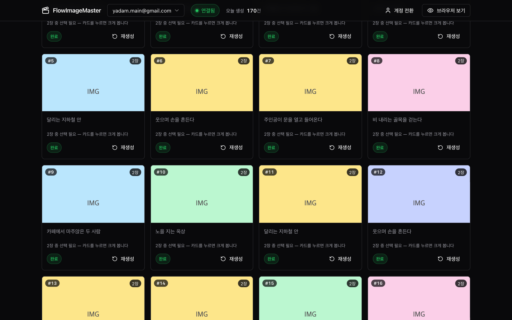

- 씬 카드의 **[재생성]**은 10장에서 설명합니다.
- **[일시정지]**는 지금 진행 중인 씬만 끝내고 멈춥니다. **[중단]**은 즉시 멈추고, 다음에 [이어서 생성]으로 남은 씬만 다시 돕니다. 이미 완료된 씬은 다시 만들지 않습니다.
- **실패한 씬**은 카드에 이유가 표시됩니다. 일시적 오류는 자동으로 최대 3회 재시도합니다. **정책 위반**은 자동 재시도하지 않고, 카드 안에서 프롬프트를 고쳐 [개별 재실행]해야 합니다.
- **한도 도달·계정 확인 요구·세션 만료**는 큐 전체를 멈추고 알림을 보냅니다. 원인을 해결한 뒤 [이어서 생성].
- 앱을 다른 창 뒤에 두고 다른 일을 해도 됩니다. 자동화 브라우저는 포커스를 가져가지 않습니다. 사용자가 뭔가 해야 할 때만 Dock/작업 표시줄이 깜빡입니다.

---

## 7. 이미지 선택 — 고르면 자동 업스케일

생성이 끝나면 카드의 **[선택 시작]**, 또는 프로젝트 화면에서 씬 카드를 눌러 선택 화면으로 들어갑니다. 화면 전체를 써서 후보를 크게 비교합니다.

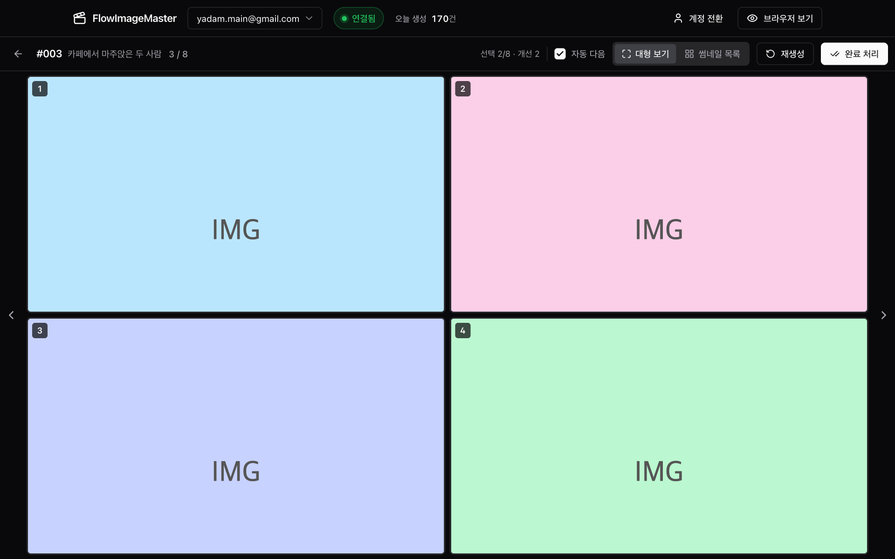

- **한 화면 = 한 씬.** 후보들이 화면에 꽉 차게 배치됩니다. 마음에 드는 그림을 **클릭**하면 선택됩니다.
- **선택하는 순간 그 이미지는 업스케일 대기열에 들어갑니다.** 다음 씬을 고르는 동안 뒤에서 Real-ESRGAN 업스케일 + 2560×1440 리사이즈 + 밝기·채도 자동 보정 + 선명화가 처리됩니다. 별도로 눌러야 할 것이 없습니다.
- 잘못 골랐으면 **다른 후보를 다시 클릭**하면 됩니다. 이전 선택은 취소되고 새 것이 대기열에 들어갑니다. 파일은 삭제되지 않습니다.
- **자동 다음**이 켜져 있으면 고른 뒤 다음 씬으로 넘어갑니다. 키보드: `←` `→` 씬 이동, `1`~`4` 번 후보 선택, `Esc` 목록으로.
- 상단의 `선택 3/8 · 개선 2`는 고른 씬 수와 업스케일이 끝난 씬 수입니다.

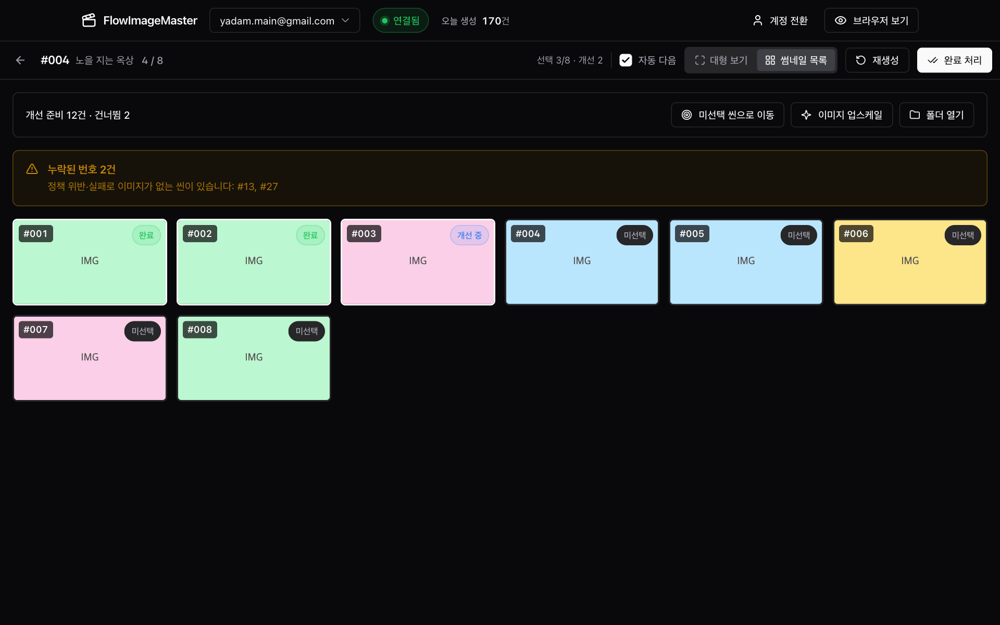

**[썸네일 목록]**으로 전체를 한눈에 봅니다. 미선택 씬은 회색 배지, 업스케일 진행 상태는 `대기 / 처리 중 / 완료` 배지로 표시됩니다. **[미선택 씬으로 이동]**이 다음 할 곳을 찾아 줍니다.

프로젝트 화면으로 돌아오면 **업스케일 대기열**이 보입니다. 아직 시작 전인 항목은 여기서 취소할 수 있습니다.

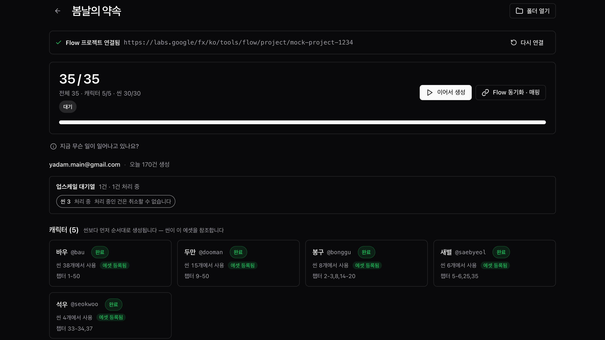

업스케일 결과는 씬 이미지 폴더 안의 `최종이미지/`에 씬 번호 이름(`001.jpg`)으로 저장됩니다. 원본 후보는 그대로 남습니다. 계정에 워터마크 제거가 켜져 있으면(13장) 업스케일 직전에 워터마크를 지웁니다.

---

## 8. 완료 처리

완료는 **사용자가 누를 때만** 기록됩니다. 씬을 전부 고르고 업스케일이 끝나도 프로젝트가 저절로 완료되지 않습니다.

프로젝트 화면에서 현재 탭에 맞는 **[씬 완료 처리] / [인트로 완료 처리] / [썸네일 완료 처리]**, 또는 셋을 순서대로 한 번에 처리하는 **[전체 완료]**를 누릅니다(대시보드 카드의 [완료 처리] = 전체 완료). 이때 비로소 그 섹션의 **고르지 않은 후보 이미지들이 휴지통으로** 이동합니다. 완료 처리 전까지는 어떤 파일도 지워지지 않으므로 언제든 선택을 바꿀 수 있고, 휴지통에서 복구도 가능합니다. 완료된 섹션은 탭에 ✓가 붙고, 그 섹션에 새 후보가 들어오면(재생성, 썸네일 만들기, 동기화 연결) 표식이 자동으로 풀립니다.

---

## 9. 문제가 생겼을 때 — Flow 연결과 복구

### Flow 프로젝트를 자동으로 못 만들었을 때

Flow 화면이 바뀌어 [새 프로젝트] 버튼을 못 찾으면 이런 안내가 뜹니다.

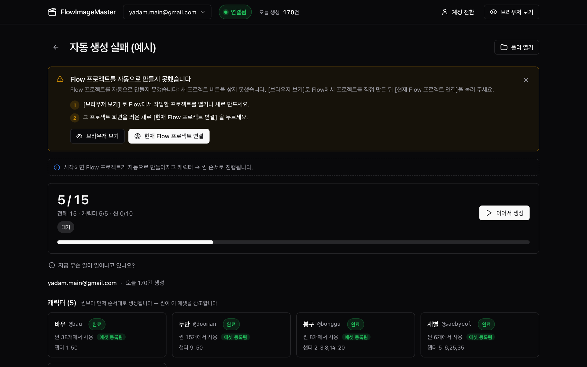

1. **[브라우저 보기]**로 Chrome 창을 꺼냅니다.
2. Flow에서 직접 프로젝트를 새로 만들거나, 이미 있는 프로젝트를 엽니다. 프로젝트 화면(주소에 `/project/…`)이 떠 있어야 합니다.
3. 앱으로 돌아와 **[현재 Flow 프로젝트 연결]**을 누릅니다. 지금 Chrome이 보고 있는 프로젝트가 이 앱 프로젝트에 묶입니다.
4. [생성 시작].

같은 방법으로 **다른 Flow 프로젝트로 바꾸는 것**도 됩니다. 프로젝트 화면의 `Flow 프로젝트 연결됨` 줄에서 **[다시 연결]**을 누르면 됩니다.

### 브라우저가 죽었거나 창을 닫아 버렸을 때

앱이 자동으로 감지해 상태를 `연결 끊김`으로 바꾸고, 다음 동작([브라우저 보기]나 [생성 시작]) 때 Chrome을 새로 띄웁니다. 로그인은 프로필에 남아 있어 다시 할 필요가 없습니다.

### 큐가 멈췄을 때

상단 배지와 알림에 이유가 나옵니다.

| 이유 | 할 일 |
|---|---|
| 재로그인 필요 | [Google 로그인] → 로그인 → 창 닫기 → [이어서 생성] |
| 생성 한도 도달 | Flow의 일일 한도입니다. 설정에서 다른 모델로 바꾸거나 다음 날 [이어서 생성] |
| 계정 확인 필요 | Flow가 사람 확인(캡차 등)을 요구합니다. [브라우저 보기]로 직접 통과한 뒤 [이어서 생성] |
| Flow 화면 변경 감지 | Flow UI가 바뀐 경우입니다. 앱 업데이트가 필요할 수 있습니다 |
| 캐릭터 등록 실패 | 캐릭터 프롬프트를 확인하고 [이어서 생성]. 이미 등록된 캐릭터는 건너뜁니다 |
| 알 수 없는 오류 반복 | 같은 오류가 3번 연속이면 멈춥니다. [로그]를 보고 [브라우저 보기]로 Flow 상태를 확인하세요 |

### 이미지가 엉뚱한 씬에 들어갔을 때

11장의 **Flow 동기화 · 씬 매핑**으로 바로잡습니다.

---

## 10. 장면 하나만 다시 만들기

한 장만 나왔거나 두 장 다 마음에 안 들 때, 씬 카드나 선택 화면의 **[재생성]**을 누릅니다.

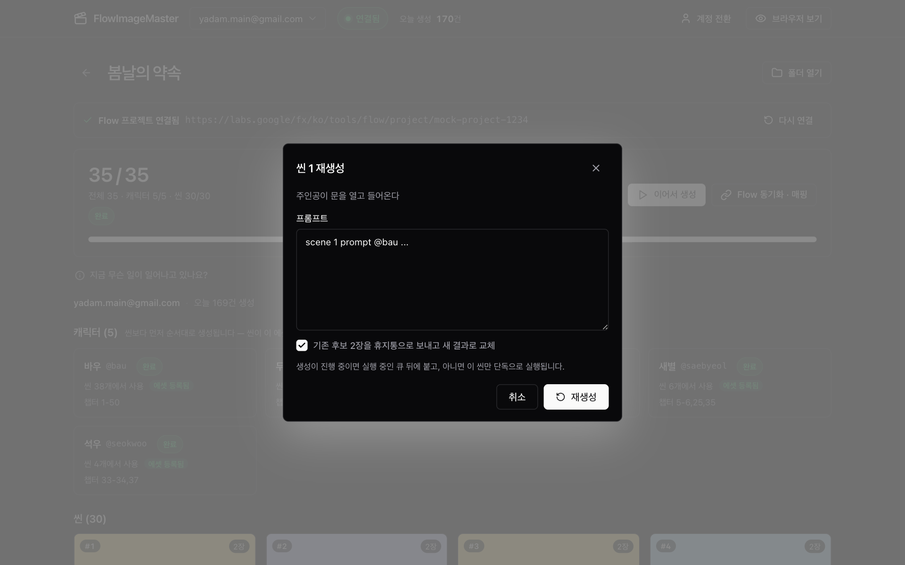

- 프롬프트를 고쳐서 보낼 수도, 그대로 한 번 더 보낼 수도 있습니다. 고친 프롬프트는 프로젝트에 저장됩니다.
- **"기존 후보를 휴지통으로 보내고 새 결과로 교체"**가 기본입니다. 체크를 끄면 기존 후보를 남기고 새 결과가 `-03`, `-04`로 추가됩니다.
- 생성이 진행 중이면 실행 중인 큐 뒤에 붙고, 아니면 그 씬만 단독으로 실행됩니다.
- 휴지통으로 보낸 이미지는 Flow에 원본이 그대로 있어서 11장의 동기화로 언제든 되찾을 수 있습니다.

---

## 11. Flow 동기화 · 씬 매핑

Flow 프로젝트가 기억하는 "이 이미지는 이 프롬프트로 만들었다"는 기록을 읽어 와서 앱의 씬과 대조하는 화면입니다. 생성이 끝난 뒤 프로젝트 화면의 **[Flow 동기화 · 매핑]**으로 엽니다. 생성 중에는 쓸 수 없습니다.

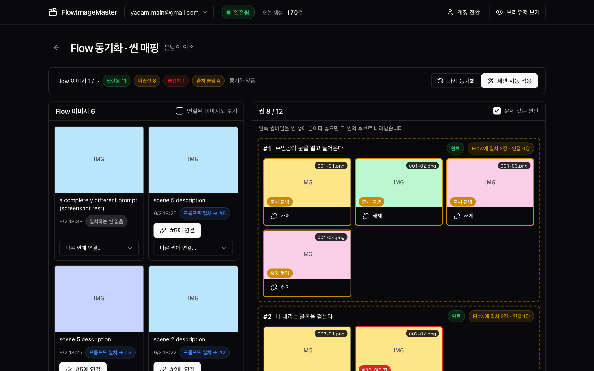

세 가지를 찾아냅니다.

| 표시 | 뜻 |
|---|---|
| **미연결** (왼쪽) | Flow에는 있는데 어느 씬에도 저장되지 않은 이미지. 프롬프트가 같은 씬을 `→ #N`으로 제안 |
| **불일치** (빨간 테두리) | 씬에 저장돼 있지만 다른 씬의 프롬프트로 만들어진 이미지. 원래 씬을 제안 |
| **출처 불명** (노란 테두리) | 어느 프롬프트로 만들었는지 기록이 없는 후보 (이전 버전에서 저장된 것). 추측하지 않고 표시만 |

손으로 고치기:

- 왼쪽 썸네일을 **오른쪽 씬 행에 끌어다 놓거나** **[#N에 연결]**을 누르면 그 씬의 후보로 내려받습니다. 다른 씬에 붙이려면 **"다른 씬에 연결…"** 드롭다운.
- 후보의 **[해제]**는 그 이미지를 씬에서 떼어 휴지통으로 보냅니다. Flow 원본은 남습니다.
- **"문제 있는 씬만"**을 끄면 모든 씬이 보입니다. **"연결된 이미지도 보기"**를 켜면 이미 연결된 Flow 이미지도 보입니다.

한 번에 정리하기 — **[제안 자동 적용]**:

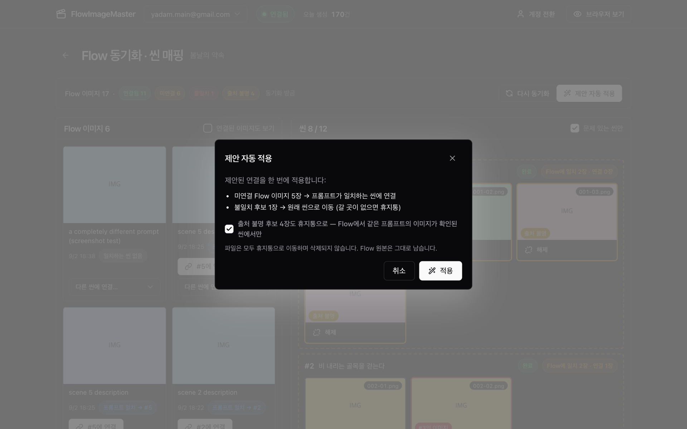

미연결 이미지는 프롬프트가 맞는 씬에 연결하고, 불일치 후보는 원래 씬으로 옮깁니다. 체크박스를 켜면 출처 불명 후보도 휴지통으로 보내는데, **Flow에서 같은 프롬프트의 이미지가 확인된 씬에서만** 그렇게 합니다. 파일은 전부 휴지통 이동이고 삭제되지 않습니다.

---

## 12. 이미지만 따로 업스케일

프로젝트와 상관없이 아무 이미지나 업스케일하고 싶을 때 홈의 **[이미지 업스케일]**을 씁니다.

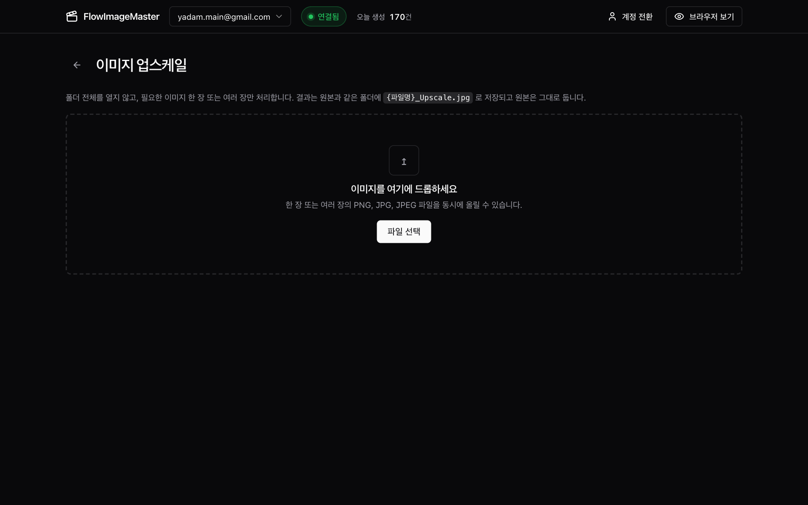

- PNG/JPG 파일을 **한 장 또는 여러 장 드롭**하거나 [파일 선택]으로 고릅니다.
- 처리 내용은 7장의 자동 업스케일과 같습니다: Real-ESRGAN → 2560×1440 → 밝기·채도 자동 보정 → 선명화.
- 결과는 **원본과 같은 폴더에 `{파일명}_Upscale.jpg`**로 저장됩니다. 새 폴더를 만들지 않고 원본도 건드리지 않습니다.
- **Flow 워터마크 제거** 체크박스를 켜면 업스케일 전에 워터마크를 지웁니다(13장). 기본값은 활성 계정의 설정을 따릅니다.

---

## 13. Flow 워터마크 제거

일부 Google 계정은 Flow 이미지 우하단에 ✦ 워터마크를 붙입니다. 계정마다 정해져 있어서(붙는 계정은 늘 붙고, 안 붙는 계정은 안 붙습니다) 앱은 이것을 **계정 옵션**으로 다룹니다. 제거는 앱 안에서 처리하며 외부 서버나 모델이 필요 없고, 장당 수 ms입니다.

### 계정 옵션 — 업스케일할 때 자동으로

**[설정] › 계정**에서 해당 계정의 "이 계정의 Flow 이미지에는 워터마크가 있음 — 업스케일 전에 제거"를 켜고 저장합니다.

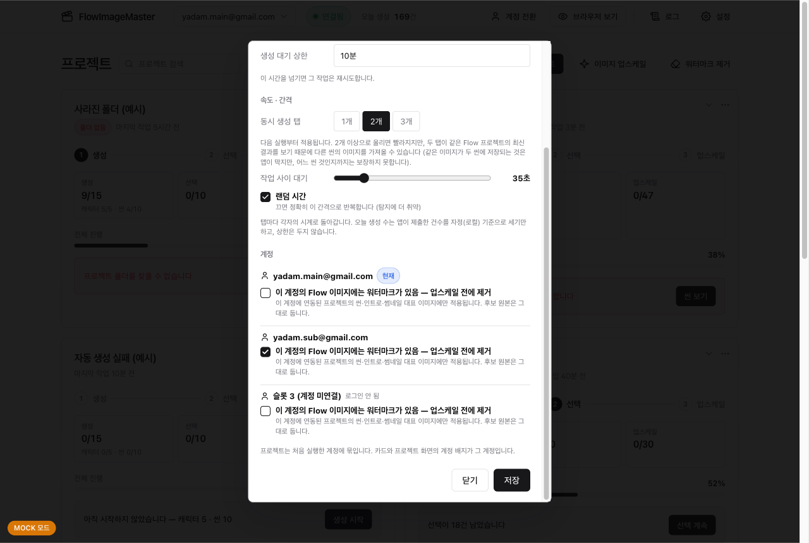

- 그 계정에 묶인 프로젝트의 **씬·인트로·썸네일 대표 이미지**는 선택 → 업스케일 흐름에서 업스케일 직전에 워터마크를 지웁니다. 따로 누를 것이 없습니다.
- **캐릭터 이미지는 대상이 아닙니다.** 후보 원본 파일은 바뀌지 않고, 결과는 `최종이미지/`에만 반영됩니다.
- 옵션을 켜기 전에 이미 업스케일한 씬은 그 후보를 **다시 클릭**하면 지우고 다시 업스케일합니다.

### 단독 도구 — 파일만 골라서

프로젝트와 상관없이 몇 장만 지우려면 홈의 **[워터마크 제거]**. 업스케일은 하지 않습니다.

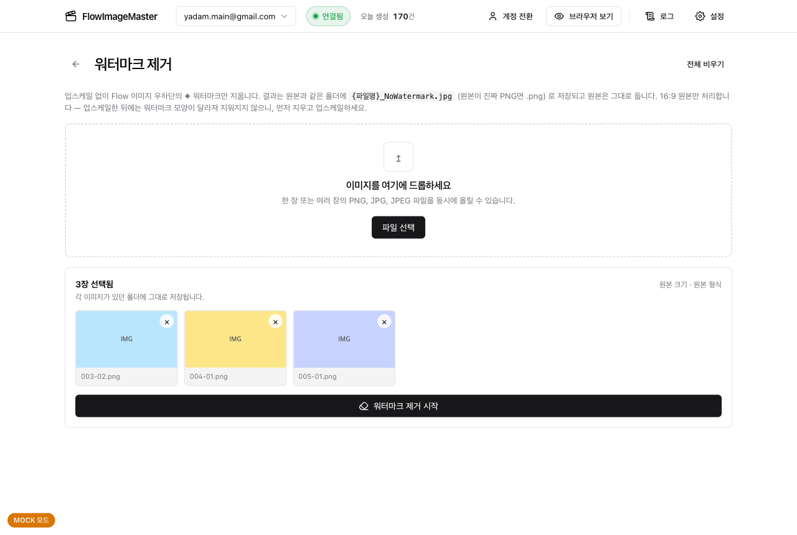

- 이미지를 드롭하거나 [파일 선택]으로 고르고 **[워터마크 제거 시작]**.
- 결과는 **원본과 같은 폴더에 `{파일명}_NoWatermark.jpg`**. 원본이 진짜 PNG면 `.png`로 저장합니다(Flow에서 받은 `.png`는 실제로 JPEG이라 `.jpg`가 됩니다). 원본은 그대로 둡니다.
- 한 장이 실패해도 나머지는 계속 처리하고, 끝에 건너뛴 파일과 사유를 보여 줍니다.

### 알아 둘 것

- **순서: 먼저 지우고, 그다음 업스케일.** 업스케일을 거친 워터마크는 모양이 달라져 지워지지 않습니다. 앱의 선택 → 업스케일 흐름은 이 순서로 자동 처리되고, 단독 도구는 업스케일 결과물(`_Upscale` 이름이거나 너비 2560 이상)을 거부하고 안내합니다.
- Flow는 워터마크를 **두 가지 세기**로 그립니다(같은 계정·같은 세션에서도 섞여 나옴). 앱이 이미지마다 세기를 재서 맞게 지우므로 신경 쓸 것은 없지만, 진한 쪽이 질감 있는 배경에 붙었으면 그 자리가 살짝 매끈해질 수 있습니다. 원본 정보가 이미 사라진 부분이라 복구할 수 없는 대신, 업스케일 후 별 윤곽은 남지 않습니다.
- **16:9 이미지만** 처리합니다. 다른 비율은 건너뛰고 원본 그대로 업스케일합니다.

---

## 14. 설정

상단 바의 **[설정]**. 저장하면 다음 실행부터 적용됩니다.

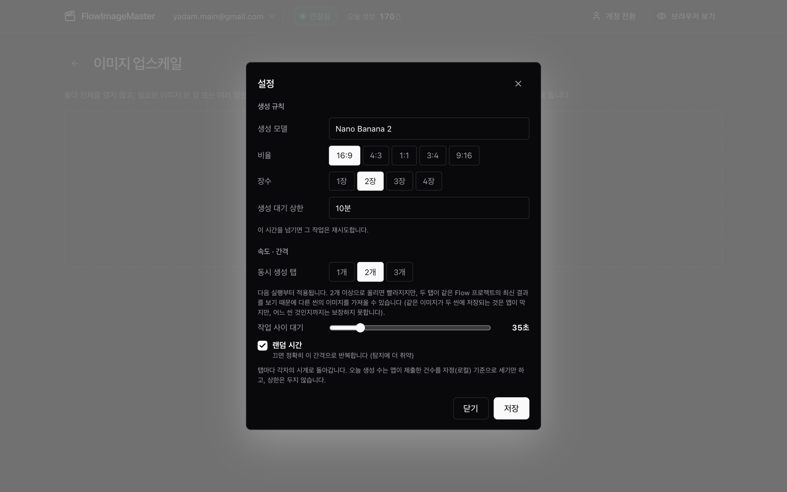

| 항목 | 설명 |
|---|---|
| 생성 모델 | Flow의 이미지 모델. 한도에 걸리면 다른 모델로 바꿔 계속할 수 있습니다 |
| 비율 | 16:9 / 4:3 / 1:1 / 3:4 / 9:16 |
| 장수 | 씬당 후보 장수 (1~4). 많을수록 고를 폭은 넓지만 생성 시간과 한도 소모가 늘어납니다 |
| 생성 대기 상한 | 이 시간 안에 결과가 안 오면 그 씬을 재시도합니다 |
| 동시 생성 탭 | 병렬로 돌릴 브라우저 탭 수. 기본 2개 |
| 작업 사이 대기 | 요청 사이 간격 (초). **랜덤 시간**을 켜면 이 값을 기준으로 매번 조금씩 다르게 기다립니다. 켜 두는 것을 권합니다 |
| 계정 | 로그인한 계정마다 **워터마크 제거** 토글 (13장). 프로젝트는 처음 실행한 계정에 묶입니다 |

---

## 15. 로그

상단 바의 **[로그]**. 큐 상태 변화, 각 씬의 시작·완료·실패 사유, Flow 프로젝트 생성, 동기화 결과가 시간순으로 남습니다. 문제를 문의할 때 이 화면 내용을 함께 보내 주세요.

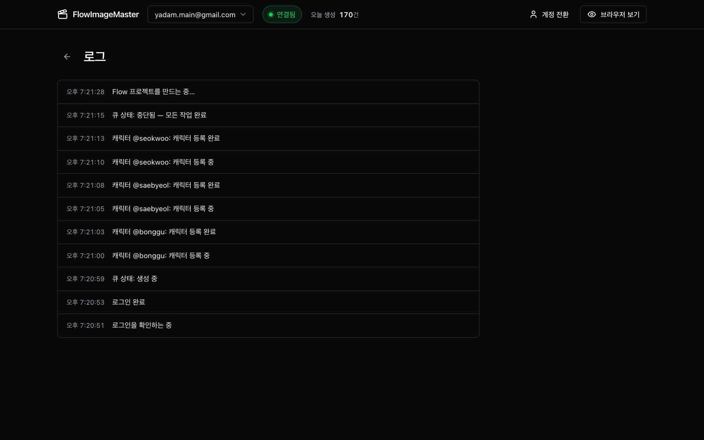

---

## 16. 자주 묻는 것

**앱을 껐다 켜면 처음부터 다시 하나요?**
아닙니다. 진행 상황은 프로젝트 폴더의 `project.json`과 이미지 파일에 저장됩니다. 완료된 씬은 건너뛰고 남은 것만 이어서 합니다.

**프로젝트 폴더를 다른 PC로 옮길 수 있나요?**
폴더째 옮기면 됩니다. `project.json`과 이미지 폴더(`Images/` 또는 예전 `Scene_Images/` 등), `selection.json`이 전부입니다. 옮긴 PC에서 그 폴더의 **`project.json`을 앱 창에 드롭**하면(어느 화면에서든) 옛 카드가 새 위치로 바뀝니다. `flow_prompts.txt`를 다시 드롭해도 같습니다.

**Flow 계정을 여러 개 쓰고 싶어요.**
[계정 전환]으로 다른 계정에 로그인하면 계정별로 별도 프로필이 생기고, 상단 드롭다운에서 바꿔 씁니다. 프로젝트는 처음 생성을 시작한 계정에 묶이고(3장), 그 계정으로만 돕니다.

**특정 이미지에서 워터마크가 안 지워져요.**
업스케일한 파일에서 지우려 한 것이 아닌지 확인하세요 — 원본에서 먼저 지우고 업스케일해야 합니다(13장). 원본인데도 남는다면 그 파일을 알려 주세요. Flow가 새로운 세기로 그린 것일 수 있습니다.

**이미지가 한 장만 나왔어요.**
Flow가 가끔 요청한 장수보다 적게 줍니다. 그 씬의 [재생성]으로 다시 받으세요.

**"오늘 생성 N건"이 실제와 달라요.**
앱이 보낸 요청만 셉니다. Flow 웹에서 직접 만든 것은 포함되지 않고, 자정에 0으로 돌아갑니다. 상한을 두고 막지는 않습니다.

**업스케일이 실패해요.**
GPU의 Vulkan 지원이 필요합니다. 그래픽 드라이버를 최신으로 올려 보세요. 업스케일이 안 돼도 선택한 원본 후보는 그대로 있습니다.

**앱을 삭제하려면?**
포터블은 exe 파일을 지우면 됩니다. 설치판은 Windows 앱 제거. 앱 데이터(브라우저 프로필, 설정)는 `%APPDATA%\FlowImageMaster` (Windows) 또는 `~/Library/Application Support/FlowImageMaster` (macOS)에 있습니다. 프로젝트 폴더는 건드리지 않습니다.

---

## 17. 변경 이력

버전별 변경 내용은 각 [Release](https://github.com/ohmyzhs/flow-image-master-releases/releases)의 노트에 있습니다. 0.4.5 이후의 변경은 [v0.4.11 노트](https://github.com/ohmyzhs/flow-image-master-releases/releases/tag/v0.4.11)에 한데 정리돼 있습니다.
